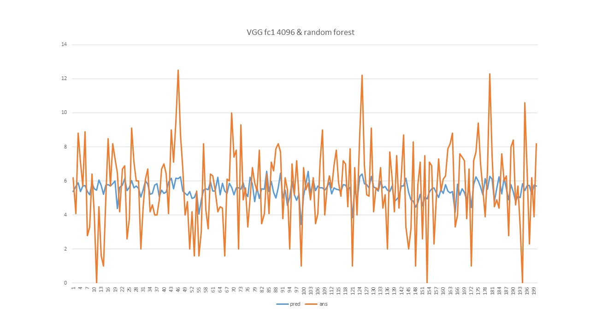
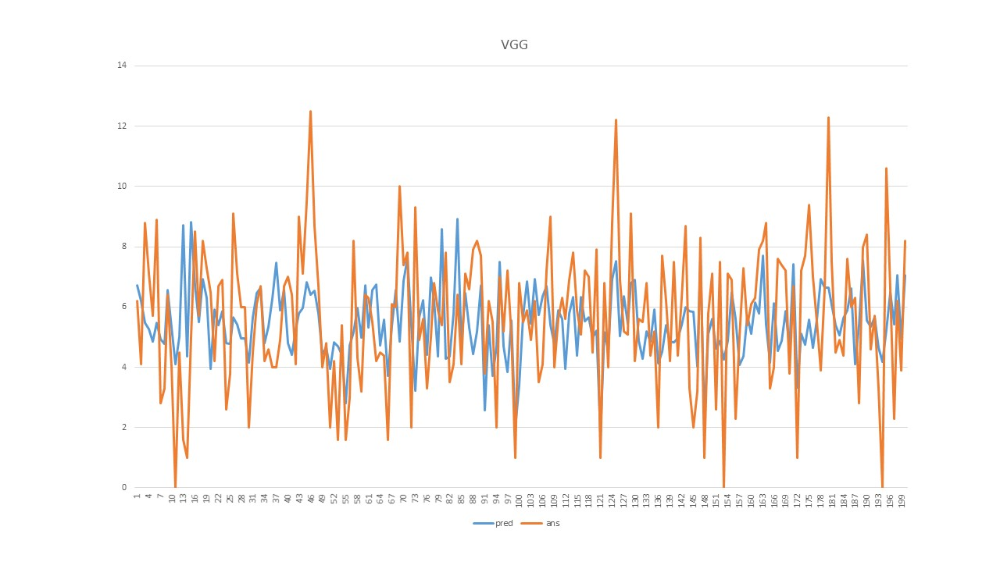
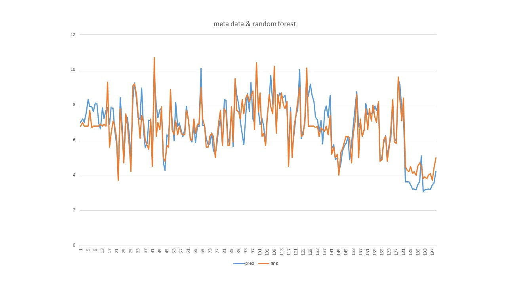

# ACM MM 2017 - Social Media Prediction

This small project just run CNN for more practical experience and compare with different
usage of CNN (and different features, but not the point).

### Task 1

* Extract features from VGG19 at fc1 layer (4096), and train it with random forest
    * MAE: 1.67, MSE: 4.41
    

* Fine tune VGG19 (using rmsprop first and then using SGD for stable descent)
    * We shrink the fc layer's neuron number because our machine is without GPU
    * MAE: 1.56, MSE: 3.94
    

* Use external data like wiews, favorate ... may fail in testing stage (they directly gave photo without link).
    * MAE: 0.63, MSE: 0.74
    
